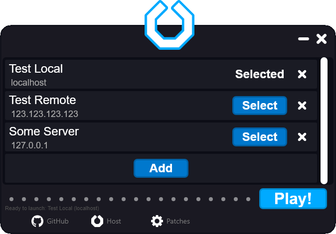

# Nexus LU Launcher
Nexus LU (LEGO Universe) Launcher is a custom, cross-platform
user interface for installing and launching LEGO Universe
for community-run LEGO Universe servers.


## Goals
The goals of the launcher is the following:
* Allow for launching the client on Windows, macOS, and Linux.
* Use a user interface similar to the original LEGO Universe launcher.
* Automate the process of downloading the client, installing patches,
  and launching LEGO Universe.
* Be able to select from a list of servers to connect to.
* Enable the installation of optional patches.
* Automate the process of basic setup for servers.
  * Note: This will be implemented later for the user interface.
    This functionally is present for the CLI build, but only supports
    Uchu right now, and still requires manually setting up databases.

## Non-Goals
The following aren't current goals of the launcher, but could
be made at some point:
* Provide a method to change the locale.
  * This feature could be worked on but requires work on the client to enable
    localization. The primary blocker for this is translations for the client.
* Automate installing WINE for non-Windows installs.
* Enable management of hosted servers, such as player permissions.
* Enable advanced, configurable patches, such as modifying the client database.

# Building
Nexus LEGO Universe Launcher requires .NET 5.0 to be installed
since it allows packaging as single files without the requirement of
decompressing files. After cloning the repository **with the submodules**,
building can be done with the `dotnet build`:
```bash
dotnet build
```
or `dotnet publish` command:
```bash
dotnet publish
```

For creating the distributables in, there is a Python script that builds the
CLI and GUI projects for win-x64, osx-x64, and linux-x64:
```bash
python publish.py
cd bin/ # The ZIP files of the distributables will be in bin/ of the repository.
```

# Additions
## Patches
Patches can be added and will be approved in pull requests if there
is a proper justification to have them. They can including finishing incomplete
features on the client, like guilds, or components that allow the client
to work, like alternative communication mods.

## Servers (Coming Soon)
Servers *will* rely mostly on the community to manage due to the implementation
requirements. It *will be* recommended to focus on servers that have a high
level of functionality, like Uchu and Operation Crux. At this point, pull
requests may not be accepted as the implementation is incomplete and may
change.

# Disclaimer
LEGO<sup>Ⓡ</sup> is a trademark of the LEGO Group. The LEGO Group is not
affiliated with this project, has not endorsed or authorized its operation,
and is not liable for any safety issues in relation to its operation.